# pheatmap

[](https://codecov.io/gh/Ann-Holmes/pheatmap)

`pheatmap` for Python.

You can create a heatmap with its annotation bars, just like pheatmap of R. Documnets at [here](https://pheatmap.readthedocs.io/en/latest/)

```mermaid
flowchart TD
    %% Client Interaction
    Client["Client Code"]:::client
    Client -->|"API_call"| A["pheatmap API (_pheatmap.py)"]:::module

    %% pheatmap Core Library Subgraph
    subgraph "pheatmap Package"
        direction TB
        A
        B["Heatmap Module (_heatmap.py)"]:::module
        C["Annotation Module (_annotation.py)"]:::module
        D["Layout Module (_layout.py)"]:::module
        E["Legend Module (_legend.py)"]:::module
        F["Utils Module (_utils.py)"]:::module
    end

    %% Internal interactions within package
    A -->|"delegates_heatmap"| B
    A -->|"handles_annotation"| C
    A -->|"manages_layout"| D
    A -->|"constructs_legend"| E
    A -->|"uses_utility"| F

    %% External Dependencies Subgraph
    subgraph "External Dependencies"
        direction TB
        H["Numpy"]:::external
        I["Pandas"]:::external
        J["Matplotlib"]:::external
    end

    %% Connections to external dependencies
    F -->|"data_handling"| H
    F -->|"data_handling"| I
    B -->|"plotting"| J
    C -->|"plotting"| J
    D -->|"layout_planning"| J
    E -->|"legend_graphics"| J

    %% Testing Suite
    M["Testing Suite (src/tests)"]:::test
    M -->|"validates"| A

    %% Documentation and CI/CD
    K["Documentation (Sphinx)"]:::externalModule
    L["CI/CD (GitHub Workflows)"]:::externalModule
    A -->|"documented"| K
    B -->|"documented"| K
    C -->|"documented"| K
    D -->|"documented"| K
    E -->|"documented"| K
    F -->|"documented"| K
    L -->|"automates"| A

    %% Click Events for components
    click A "https://github.com/ann-holmes/pheatmap/blob/main/src/pheatmap/_pheatmap.py"
    click B "https://github.com/ann-holmes/pheatmap/blob/main/src/pheatmap/_heatmap.py"
    click C "https://github.com/ann-holmes/pheatmap/blob/main/src/pheatmap/_annotation.py"
    click D "https://github.com/ann-holmes/pheatmap/blob/main/src/pheatmap/_layout.py"
    click E "https://github.com/ann-holmes/pheatmap/blob/main/src/pheatmap/_legend.py"
    click F "https://github.com/ann-holmes/pheatmap/blob/main/src/pheatmap/_utils.py"
    click M "https://github.com/ann-holmes/pheatmap/tree/main/src/tests"
    click K "https://github.com/ann-holmes/pheatmap/tree/main/docs"
    click L "https://github.com/ann-holmes/pheatmap/tree/main/.github/workflows"

    %% Styling Classes
    classDef module fill:#AED6F1,stroke:#1F618D,stroke-width:2px;
    classDef client fill:#FAD7A0,stroke:#D35400,stroke-width:2px;
    classDef external fill:#A9DFBF,stroke:#27AE60,stroke-width:2px;
    classDef externalModule fill:#F9E79F,stroke:#B7950B,stroke-width:2px;
    classDef test fill:#F5B7B1,stroke:#C0392B,stroke-width:2px;
```



> [!Note]
> The structure of `pheatmap` for Python is generated by [GitDiagram](https://github.com/ahmedkhaleel2004/gitdiagram). 
> Thanks!

## Requirements

`pheatmap` need `python` > 3.8, and `numpy`, `pandas` and `matplolib`. 

## Install

You can install `pheatmap` by `pip`. 

```shell
pip install pheatmap
```

Run the command above, `pip` will automatically install `numpy`, `pandas` and `matplolib`.

## Usage

```python
import numpy as np
import pandas as pd
from pheatmap import pheatmap

nrows, ncols = 10, 10
mat = np.linspace(-1, 1, nrows * ncols).reshape(nrows, ncols)
rownames = ["abcdefghig"[i % 10] for i in np.arange(nrows)]
colnames = ["xyz"[i % 3] for i in np.arange(ncols)]

mat = pd.DataFrame(mat, index=rownames, columns=colnames)

anno_row = pd.DataFrame(dict(
    anno1=np.linspace(0, 10, nrows),
    anno2=["CNS"[i % 3] for i in np.arange(nrows)]
))
anno_col = pd.DataFrame(dict(
    anno3=np.linspace(0, 20, ncols),
    anno4=["ABC"[i % 3] for i in np.arange(ncols)]
))

anno_row_cmaps = {"anno1": "Blues", "anno2": "Set1"}
anno_col_cmaps = {"anno3": "Purples", "anno4": "Set3"}

fig = pheatmap(
    mat, annotation_row=anno_row, annotation_col=anno_col,
    annotation_row_cmaps=anno_row_cmaps, annotation_col_cmaps=anno_col_cmaps
)
fig.savefig("tests/pheatmap.png")
```

Run the above code at the ipython or jupyter notebook. You can see the fellow heatmap with its
annotation bars. 


Also, you can save the figure to file. For example, save the figure to `PDF` file. 

```python
fig.savefig("pheatmap.pdf")
```
