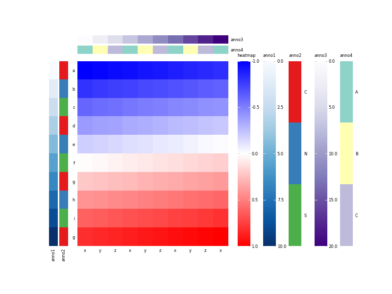

# pheatmap

pheatmap for Python

You can create a heatmap with its annotation bars, just like pheatmap of R. 

## Install


## Usage

```python
import numpy as np
import pandas as pd
from pheatmap import pheatmap

nrows = 30
mat = pd.DataFrame(np.arange(nrows * 1000).reshape(-1, 1000))
anno_row = pd.DataFrame(
    dict(anno1=np.arange(nrows), anno2=["CNS"[i % 3] for i in np.arange(nrows)])
)
anno_col = pd.DataFrame(
    dict(anno2=np.arange(1000), anno3=["abcdefghigk"[i % 10] for i in np.arange(1000)])
)
fig = pheatmap(
    mat,
    annotation_row=anno_row,
    annotation_col=anno_col,
    show_colnames=False
)
plt.figure(fig)
plt.show()
```

Run the above code at the ipython or jupyter notebook. You can see the fellow heatmap with its
annotation bars. 



Also, you can save the figure to file. For example, save the figure to `PDF` file. 

```python
fig.savefig("pheatmap.pdf")
```