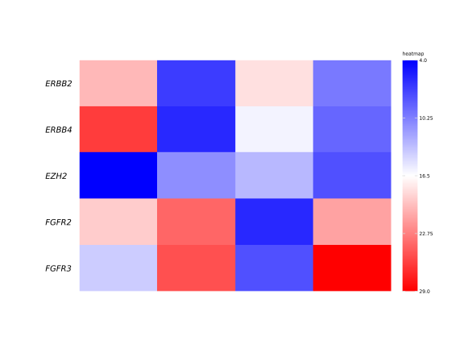
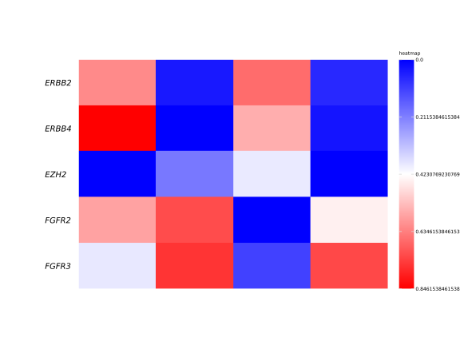
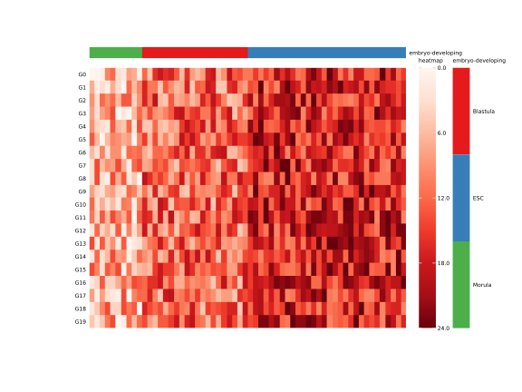
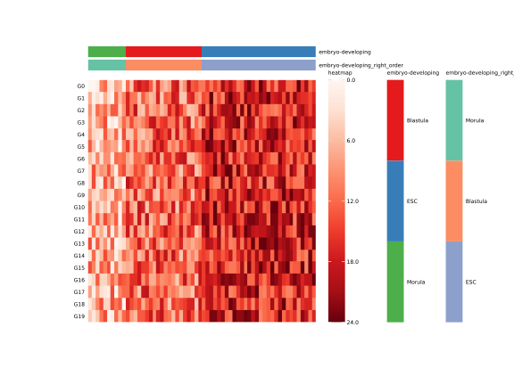

# Advance Usage

## some_style

For the arguments ended with 'style', you can give a `dict`, which can be used to control text's style.
For example, `rownames_style` can change the style of row's names. 

First, we create a DataFrame represent a gene expresion matrix. 

```python
mat = pd.DataFrame(
    np.random.randint(0, 30, 20).reshape(5, 4), 
    index=["ERBB2", "ERBB4", "EZH2", "FGFR2", "FGFR3"]
)
```

The default heatmap of the above DataFrame is as follow:

```python
fig = pheatmap(mat=mat, show_colnames=False)
```


Now, we can change fontsize to 10pt(default: 6pt), fontstyle to "italic"(default: normal) and left align.
> Note: left align, the rownames will be overlap with heatmap, therefore, need to adjust rownames to left by `position`


```python
fig = pheatmap(
    mat=mat, show_colnames=False,
    rownames_style={"fontsize": 10, "fontstyle": "italic", "ha": "left", "position": (-0.1, 0)}
)
```


## Legend

For legend, you can adjust every legend by point the legend's name as keys to `legend_*`. For example, we can
normalize the genes' expression to [0, 1] by max-min normalize.

```python
mat = (mat - mat.min()) / mat.max()
fig = pheatmap(
    mat=mat, show_colnames=False,
    rownames_style={"fontsize": 10, "fontstyle": "italic", "ha": "left", "position": (-0.1, 0)},
)
```


But the legend's labels are not beautiful, you can modify it by youself.

```python
fig = pheatmap(
    mat=mat, show_colnames=False,
    rownames_style={"fontsize": 10, "fontstyle": "italic", "ha": "left", "position": (-0.1, 0)},
    legend_tick_locs={"heatmap": np.arange(0, 1, 0.2)}, 
    legend_tick_labels={"heatmap": [f"{i:.3f}" for i in np.arange(0, 1, 0.2)]}
)
```


You can also change label style for legend tick labels, such as: fontsize, rotation, fontstyle, etc. 

```python
fig = pheatmap(
    mat=mat, show_colnames=False,
    rownames_style={"fontsize": 10, "fontstyle": "italic", "ha": "left", "position": (-0.1, 0)},
    legend_tick_locs={"heatmap": np.arange(0, 1.2, 0.2)}, 
    legend_tick_labels={"heatmap": [f"{i:.3f}" for i in np.arange(0, 1.2, 0.2)]},
    legend_tick_labels_styles={"fontsize": 8, "color": "gray"}
)
```


## Annotation Advance

Annotations can be continuous or discrete for rows or columns. If the annotation is discrete, you can
specify the order of the categories. For example, we want to visualize some gene expression dynamic
along with the embryo development.

```python
mat = pd.DataFrame(
    np.hstack([np.random.randint(0, 15, 20 * 10).reshape(20, 10),
              np.random.randint(5, 20, 20 * 20).reshape(20, 20),
              np.random.randint(10, 25, 20 * 30).reshape(20, 30)]),
    index=[f"G{i}" for i in np.arange(20)]
)
anno_col = pd.DataFrame({
    "embryo-developing": np.hstack([np.repeat(["Morula"], 10), np.repeat(["Blastula"], 20), np.repeat(["ESC"], 30)])
})
fig = pheatmap(
    mat, cmap="Reds",
    annotation_col=anno_col,
    annotation_col_cmaps={"embryo-developing": "Set1"},
    show_colnames=False
)
```


The legend's of embryo-developing annotation is not right order of embryo development. You can
specify the order by the follow method:

```python
anno_col["embryo-developing_right_order"] = anno_col["embryo-developing"].astype(
    pd.CategoricalDtype(["Morula", "Blastula", "ESC"]))
fig = pheatmap(
    mat, cmap="Reds", annotation_col=anno_col,
    annotation_col_cmaps={"embryo-developing_right_order": "Set2", "embryo-developing": "Set1"},
    show_colnames=False, legend_bar_space=2.5
)
```



More information to see [`pheatmap` API](API.rst).