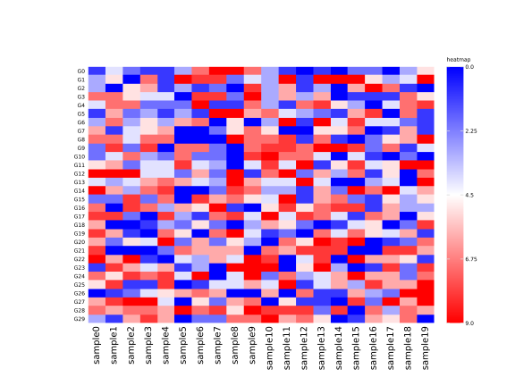
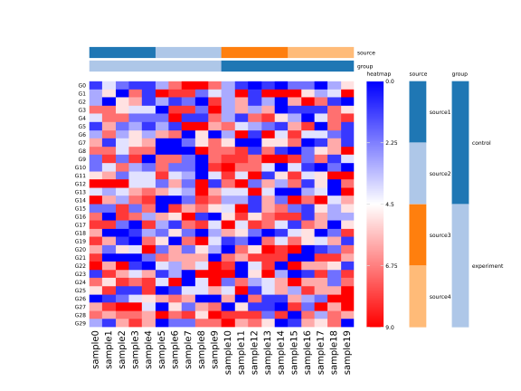
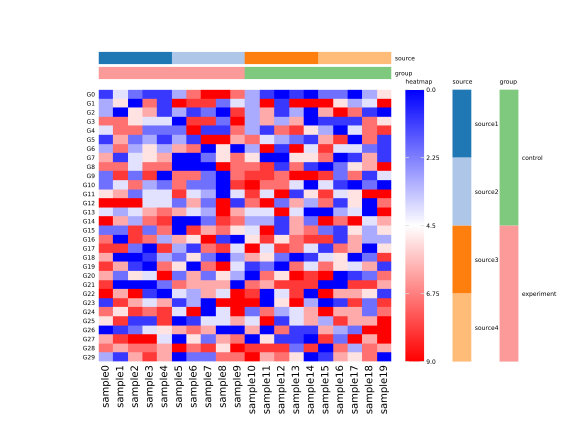
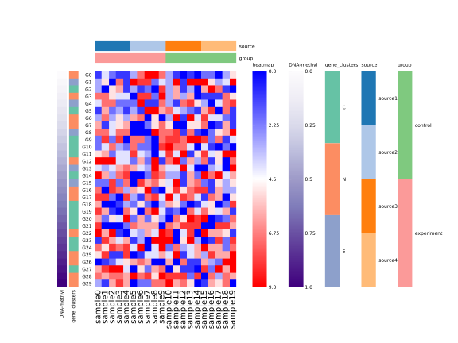

# Basic Usages

## Introduction

`pheatmap` is a Python package for ploting heatmap with annotation bars. It just like `pheatmap` 
package of R.

## Installation

You can install `pheatmap` by `pip`: 

```shell
pip install pheatmap
```

Run the above command, `pip` will intall `pheatmap` and its dependencies, `numpy`, `pandas` and 
`matplotlib`. 


## Quick Start

Before create heatmap, we need to import some essential packages. 

```python
import pandas as pd
import numpy as np
from pheatmap import pheatmap
```

### Simple Heatmap

First, we can create a DataFrame, each row means a gene, and columns are samples. 

```python
mat = pd.DataFrame(
    np.random.randint(0, 10, 600).reshape(30, 20),
    index=[f"G{i}" for i in np.arange(30)],
    columns=[f"sample{i}" for i in np.arange(20)]
)
# Show some expression values
mat.iloc[:, :5].head()
```

|    |   sample0 |   sample1 |   sample2 |   sample3 |   sample4 |   sample5 |
|:---|----------:|----------:|----------:|----------:|----------:|----------:|
| G0 |         4 |         9 |         4 |         6 |         6 |         1 |
| G1 |         1 |         4 |         6 |         3 |         2 |         1 |
| G2 |         8 |         8 |         9 |         1 |         0 |         8 |
| G3 |         2 |         5 |         9 |         3 |         2 |         3 |
| G4 |         4 |         6 |         8 |         3 |         2 |         1 |

Then, we can plot a simple heatmap for these genes' expression on samples: 

```python
fig = pheatmap(mat, colnames_style={"rotation": 90})
```


### Annotation Heatmap

#### Annotation columns
If we have some information for samples, such as experiment v.s. control or sample source, then we can and these 
information to the plot by `annotation_col` parameter.

```python
# Create DataFrame, store samples' information
anno_col = pd.DataFrame({
    "source": np.repeat(["source1", "source2", "source3", "source4"], 5),
    "group": np.repeat(["experiment", "control"], 10)
})
fig = pheatmap(mat, annotation_col=anno_col, colnames_style={"rotation": 90}, legend_bar_space=1.5)
```


We can point colors for every annotation bar by `annotation_col_cmaps` parameter.
`annotation_col_cmaps` need a `dict`, the keys of `dict` are the anno_col's columns, and the values
of dict are the colors. If the number of colors are not enough for the categories', `pheatmap` will
cycle the colors to fullfill the number of categories. 

```python
fig = pheatmap(
    mat, annotation_col=anno_col,
    annotation_col_cmaps={"group": ["#7FC97F", "#FB9A99"]},
    colnames_style={"rotation": 90}, legend_bar_space=1.5
)
```


#### Annotation Rows

We can also add annotations for genes. For example, we want to check the degree of DNA methylation
for genes. We can put the degree of DNA methylation on the left of heatmap. By the way, we have the
information of clusters for genes and want to see it at the same time. 

```python
anno_row = pd.DataFrame({
    "DNA-methyl": np.linspace(0, 1, 30),
    "gene_clusters": ["CNS"[i % 3] for i in np.random.randint(0, 10, 30)]
})
fig = pheatmap(
    mat, 
    annotation_col=anno_col,
    annotation_col_cmaps={"group": ["#7FC97F", "#FB9A99"]},
    annotation_row=anno_row,
    annotation_row_cmaps={"DNA-methyl": "Purples", "gene_clusters": "Set2"},
    colnames_style={"rotation": 90}, 
    legend_bar_space=1.5, 
    wspace=0.15
)
fig.savefig("row_col_anno_heatmap.svg")
```

